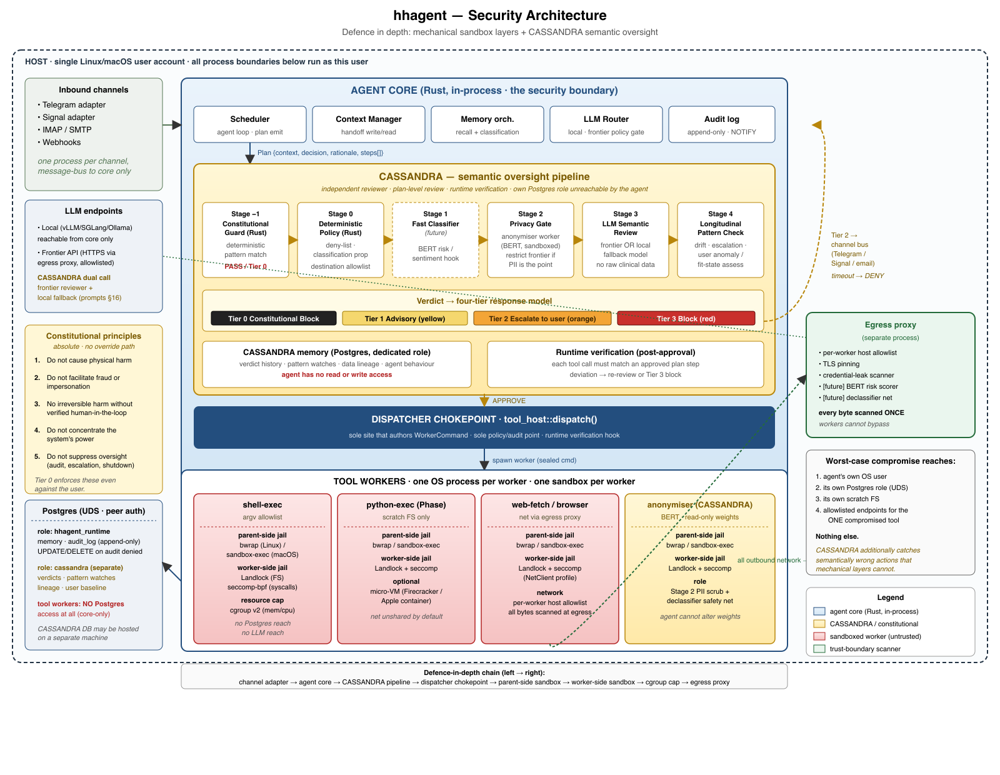
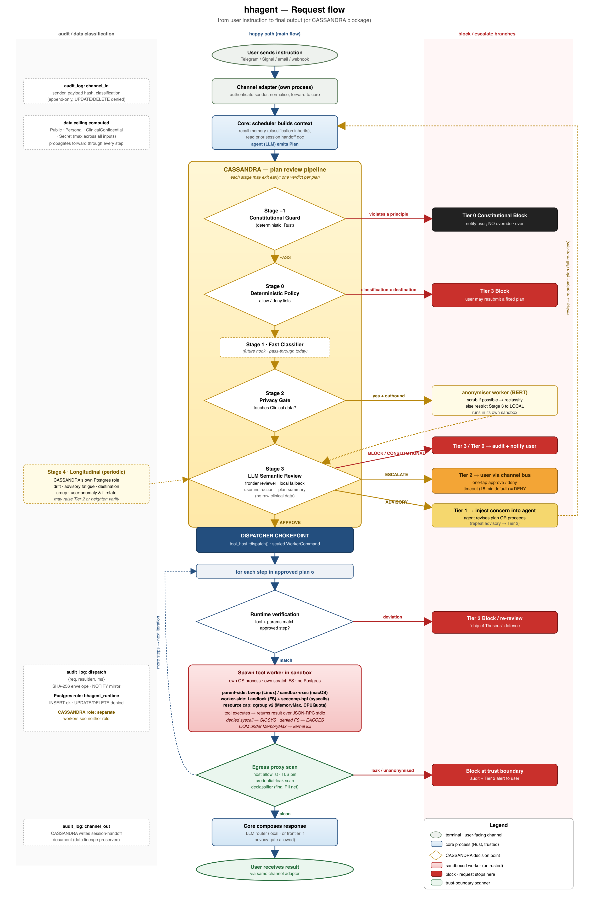

# kastellan

<p align="center">
  
</p>

A personal, always-on agentic system designed from the ground up for security and vendor neutrality.

## What it is

A long-running personal AI agent designed to:

- talk to you over secure messaging (Telegram, Signal) and email (its own IMAP/SMTP account)
- remote-control a web browser, perform web searches and page fetches
- execute Python in a strict sandbox
- maintain persistent memory in Postgres with hybrid retrieval (pgvector + lexical + graph)
- review its own plans through **CASSANDRA**, a semantic oversight layer with hard-coded constitutional constraints, before any tool runs
- run continuously, periodically resetting its context window from memories and a persistent task list

Not all of this is built yet — see [Status](#status) for what works today versus
what's still on the roadmap.

## Design priorities (in order)

1. **Security boundary = the agent's own OS user account.** Worst-case compromise (LLM, tool, dependency, or LLM-authored Python) does not escape that boundary.
2. **Vendor neutrality.** Primary host is the NVIDIA DGX Spark, but no hard NVIDIA dependency. Linux and macOS are both first-class.
3. **License hygiene.** Project is AGPL-3.0; every dependency is AGPL-compatible.
4. **Small core.** The agent core is Rust (no eval, no metaprogramming, no dynamic import). Python lives only inside sandboxed workers.

## Security architecture

<p align="center">
  
</p>

The mechanical layers along the bottom of the diagram — bwrap, Landlock,
seccomp, the egress proxy, the dispatcher chokepoint — enforce *boundaries*:
"this process cannot open that socket." The **CASSANDRA** layer running
alongside the agent core enforces *intent*: "should the agent be doing this
at all, given what the user actually asked for?" CASSANDRA reviews each
plan (not each tool call) through a pipeline of deterministic and LLM
stages, with five hard-coded constitutional constraints that no user,
admin, or configuration change can override. See
[`docs/cassandra_design_plan.md`](docs/cassandra_design_plan.md).

The diagram below traces a single user instruction through every gate —
channel ingress, plan formulation, the CASSANDRA review pipeline
(Stages −1 through 4), the dispatcher chokepoint, sandboxed worker
execution, and the egress proxy — with the block / advisory / escalation
branches drawn explicitly. Source: [`docs/security-request-flow.svg`](docs/security-request-flow.svg).

<p align="center">
  
</p>

## Why another one?

Several Rust personal-agent projects exist in the OpenClaw-derived
family — notably [IronClaw](https://github.com/nearai/ironclaw) and
[ZeroClaw](https://github.com/zeroclaw-labs/zeroclaw). They share a lot
with kastellan: Rust core, local-first, OS sandboxing, MCP-compatible IPC.
The reason for *another* one is posture, not feature count: **security
is the foundational property here, not a layer added later.** Each rule
below is a load-bearing invariant, not a default we relax under deadline
pressure.

- **One OS process + one kernel sandbox per tool invocation.** IronClaw
  runs tools as WASM modules inside the runtime; ZeroClaw runs them as
  in-process Rust traits with the OS sandbox wrapping the *whole*
  runtime. Both are software-only or coarse-grained boundaries.
  kastellan's boundary is the OS process boundary — `bubblewrap` on
  Linux, `sandbox-exec` on macOS — so a compromised tool reaches at
  most the endpoints in *that tool's* allowlist, never the next
  tool's, and never the core.

- **Double containment.** The parent installs the OS sandbox at spawn;
  the worker then installs a *second* layer on itself
  (Landlock + seccomp-bpf on Linux) before serving any JSON-RPC
  request. A kernel bug in either layer alone does not breach the
  worker. See [`workers/prelude/`](workers/prelude/).

- **seccomp is an allow-list, not a deny-list.** Default action is
  `KillProcess`; ~110 base syscalls plus per-profile additions
  (e.g. the BSD-socket family for `WorkerNetClient`) are explicitly
  permitted. The kill-list-of-obviously-bad-calls posture common
  elsewhere lets new attack syscalls walk in unchallenged every time
  the kernel grows.

- **Dispatcher chokepoint.** A single function authors every
  `WorkerCommand`, consults policy, and writes the audit-log entry.
  New channels (Telegram, Signal, IMAP) and scheduled routines call
  into it — they never spawn workers themselves. Borrowed from
  IronClaw's `ToolDispatcher::dispatch()` and made non-negotiable.

- **Semantic oversight on top of mechanical sandboxing
  (CASSANDRA).** Kernel sandboxes catch "this process tried to open
  that socket"; they cannot catch "send this confidential pathology
  report to a recipient who happens to be permitted but contextually
  wrong." Every plan the agent formulates is reviewed by CASSANDRA
  before any tool runs — a chain of deterministic and LLM stages
  enforcing five **constitutional constraints** (no physical harm,
  no fraud / impersonation, no irreversible action without verified
  human-in-the-loop, no power concentration, no oversight
  suppression) that no user, admin, or configuration change can
  override. Runtime verification at the dispatcher then re-checks
  that what executes matches what was approved. The agent core never
  bypasses this gate. See
  [`docs/cassandra_design_plan.md`](docs/cassandra_design_plan.md).

- **AGPL with AGPL-compatible deps only.** No CDDL, BUSL, SSPL,
  Elastic License, or "source-available" components. License hygiene
  is part of the security boundary: a permissive dep can re-enter the
  process under a corporate fork the user cannot audit.

- **Cross-platform parity by construction.** The same `SandboxPolicy`
  struct drives both backends. Linux's stronger stack
  (bwrap + Landlock + seccomp) and macOS's weaker stack (Seatbelt) are
  both first-class with negative tests asserting that denials actually
  deny. The asymmetry between them is documented openly in
  [`docs/threat-model.md`](docs/threat-model.md) rather than papered
  over.

- **No vendor lock-in.** Primary host is the NVIDIA DGX Spark, but
  nothing in the core requires NVIDIA, CUDA, or a specific cloud.
  Local LLMs run via vLLM/SGLang on Linux or llama.cpp/Ollama on macOS
  behind an OpenAI-compatible HTTP API.

The full set of invariants — including secret handling, single-point
egress inspection, and the "no in-process untrusted code" rule — lives
in [`docs/architecture.md`](docs/architecture.md). Reviewers are
expected to refuse PRs that violate them.

## Status

**Past scaffold. Phase 1 (Memory & Loop) is essentially complete and Phase 3
web egress has begun.** The project is a Rust workspace of 10 crates with a
working agent loop, real cross-platform sandboxing, persistent memory, and the
first net-egress worker.

What works today:

- **Sandboxing — double-contained, cross-platform.** `bubblewrap` + Landlock +
  seccomp-bpf on Linux (wrapped in a `systemd-run --scope` cgroup for CPU/memory
  caps); `sandbox-exec` (Seatbelt) plus an opt-in Apple `container` micro-VM
  backend on macOS. One OS process and one kernel sandbox per worker, all driven
  from a single `SandboxPolicy`, with negative tests asserting that denials deny.
- **Agent loop + scheduler.** A Postgres-backed task queue (`LISTEN/NOTIFY`,
  leased claims) running the LLM plan → **CASSANDRA** review → dispatcher
  chokepoint → sandboxed-step loop, with append-only audit rows at every
  lifecycle transition and a crash-recovery sweep.
- **CASSANDRA oversight.** Constitutional and deterministic (data-classification)
  policy stages with an offline replay/iteration harness; a worker-output
  prompt-injection guard that redacts and audits blocked content.
- **Memory.** Three-lane recall (pgvector semantic + `tsvector` lexical + graph)
  fused with Reciprocal Rank Fusion; layered prompt assembly (L0 meta-rules, L1
  always-in-context index, L3 approved skills); entity/relation extraction with a
  quarantine-review CLI; a large-tool-result handoff cache.
- **L3 skill arc.** Crystallise a successful trajectory → operator approve/pin →
  recall-surface → re-invoke, with trust tiers and live re-validation at dispatch.
- **Workers.** `shell-exec` (argv-allowlisted execve), `web-fetch` (HTTPS-only,
  host-allowlisted, redirect/size-capped readable-text extraction — the first
  `Net::Allowlist` consumer), and `gliner-relex` (Python entity/relation
  extraction under the sandbox).
- **Supporting infrastructure.** OS-native supervisor units (`systemd --user` /
  launchd) including an `kastellan.target`; AES-256-GCM secrets at rest with opaque
  `secret://` references; an OpenAI-compatible, local-first LLM router; a
  `kastellan-cli audit tail` viewer.

Not built yet (see the roadmap): channel adapters (Telegram/Signal/email),
outbound messaging, the browser worker, `python-exec`, the egress proxy + its
credential-leak scanner, and the Phase-5 frontier-escalation policy gate.

Day-to-day state — what's green and the next task — lives in
[`docs/devel/handovers/HANDOVER.md`](docs/devel/handovers/HANDOVER.md); the
sequenced build plan is [`docs/devel/ROADMAP.md`](docs/devel/ROADMAP.md). See also
[`docs/architecture.md`](docs/architecture.md) and
[`docs/threat-model.md`](docs/threat-model.md).

## Layout

Rust workspace, 10 crates:

```
core/                 kastellan-core: agent loop, scheduler, memory, CASSANDRA, audit,
                      tool-host chokepoint, handoff cache; `kastellan` daemon + `kastellan-cli`
db/                   kastellan-db: Postgres helpers + embedded migrations (pgvector +
                      tsvector/GIN + relational graph), secrets-at-rest, audit writer
llm-router/           kastellan-llm-router: sole egress for LLM calls (OpenAI-compatible HTTP)
sandbox/              kastellan-sandbox: SandboxPolicy + per-OS backends
                      (bwrap / Seatbelt / Apple container)
supervisor/           kastellan-supervisor: systemd --user / launchd unit generation + drivers
protocol/             kastellan-protocol: JSON-RPC 2.0 over stdio (MCP-stdio compatible)
tests-common/         kastellan-tests-common: shared dev-dep test harness (Pg cluster, fixtures)
workers/prelude/      Landlock + seccomp lock-down prelude (worker-side `serve_stdio`)
workers/shell-exec/   argv-allowlisted execve worker
workers/web-fetch/    HTTPS-only, host-allowlisted fetch + readable-text extraction
workers/gliner-relex/ Python entity/relation extraction worker (sandboxed)

adapters/             channel adapters (Telegram, Signal) — placeholders, Phase 2
config/               example runtime policy + per-worker sandbox profiles
seeds/                L0 memory meta-rule seed data
scripts/              host setup (AppArmor profile, Postgres install)
docs/                 architecture, threat-model, CASSANDRA design, roadmap, handovers
```

(`workers/{browser-driver,mail,python-exec}` exist as placeholders for later phases.)

## Setup

### Linux (Ubuntu 24.04+)

The kernel restricts unprivileged user namespaces by default
(`kernel.apparmor_restrict_unprivileged_userns=1`), so `bwrap` cannot create
its own jail without a per-binary AppArmor profile. Install one once:

```sh
sudo scripts/linux/install-bwrap-apparmor-profile.sh
```

This is the same pattern Flatpak uses (`/etc/apparmor.d/flatpak`). After
installing, sandbox tests should pass:

```sh
cargo test -p kastellan-sandbox
```

If you skip this step, the agent will refuse to spawn workers and emit a
clear error pointing back here. Other Linux distros without AppArmor user-ns
restrictions don't need this script.

## License

AGPL-3.0-only. See [LICENSE](LICENSE).
