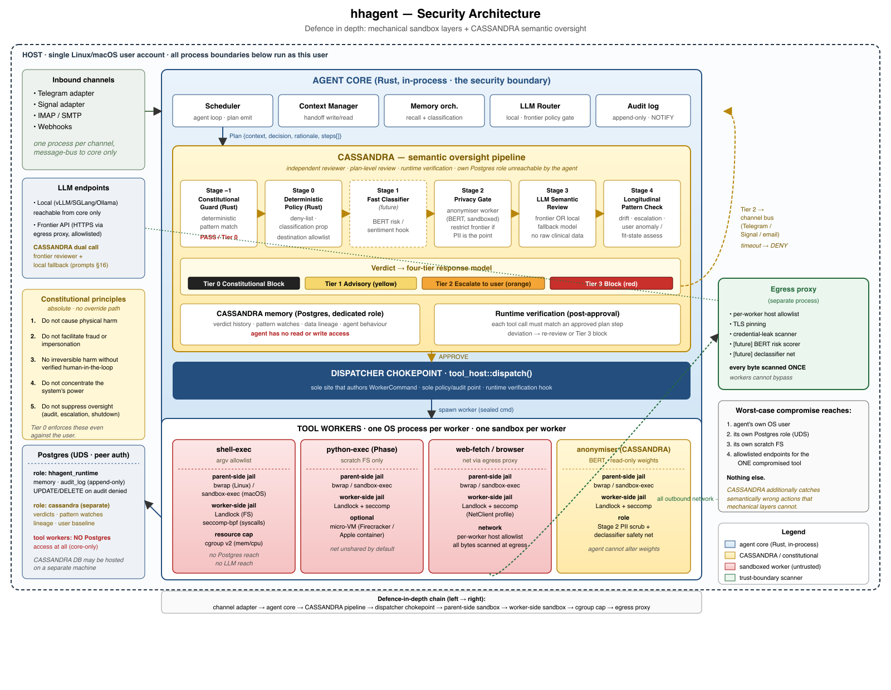
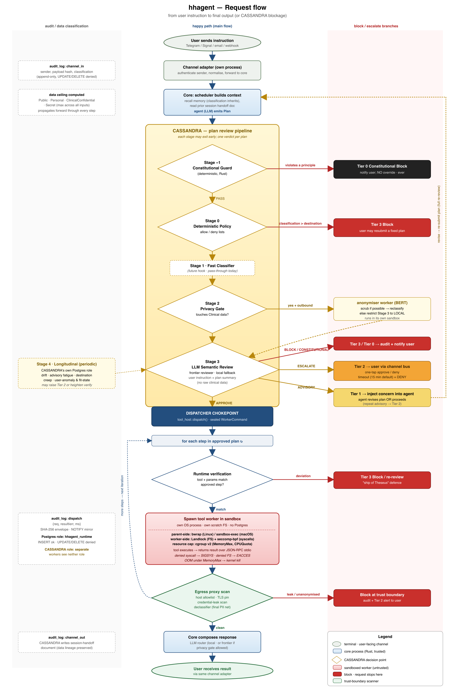

# Kastellan - the *trustworthy* personal autonomous agent

<p align="center">
  
</p>

> A castellan is the officer a lord entrusts to hold a stronghold:
> full authority within the walls, none to act beyond them.

Kastellan is a personal, always-on AI agent built so that security is its
foundational property, not a layer added later. It talks to you over Matrix —
self-hosted, single-user, federation off, end-to-end encrypted — with email as
a low-trust failover, drives a browser, searches and fetches the web, executes
Python, and maintains persistent memory in Postgres with hybrid retrieval. But
every tool runs inside its own
kernel sandbox, bounded to that tool's own allowlist, and every plan it forms
is first reviewed by **CASSANDRA** — a semantic oversight layer enforcing five
constitutional constraints that no user, admin, or configuration change can
override.

The name is the design. Kastellan acts on your behalf and runs unattended,
but only ever within boundaries it cannot widen for itself: mechanical ones
(the OS process boundary, with bubblewrap, Landlock, and seccomp) and semantic
ones (CASSANDRA). It is vendor-neutral by construction — the primary host is
the NVIDIA DGX Spark, but nothing in the core requires NVIDIA or a specific
cloud, and Linux and macOS are both first-class. The core is small and Rust,
with no eval, no metaprogramming, and no dynamic import; Python lives only
inside sandboxed workers.

## What it is

A long-running personal AI agent designed to:

- talk to you over Matrix (self-hosted, single-user, federation off, end-to-end encrypted), with email (its own IMAP/SMTP account) as a low-trust cross-transport failover
- remote-control a web browser, perform web searches and page fetches
- execute Python in a strict sandbox
- maintain persistent memory in Postgres with hybrid retrieval (pgvector + lexical + graph)
- review its own plans through **CASSANDRA**, a semantic oversight layer with hard-coded constitutional constraints, before any tool runs
- run continuously, periodically resetting its context window from memories and a persistent task list

Not all of this is built yet — see [Status](#status) for what works today versus
what's still on the roadmap.

> **New here?** The [**User Manual**](docs/user/manual/index.md) explains — in
> plain language, for non-developers — what Kastellan is, how it's built, how it
> protects you, and how to set it up and run it.

## Design priorities (in order)

1. **Security boundary = the agent's own OS user account.** Worst-case compromise (LLM, tool, dependency, or LLM-authored Python) does not escape that boundary.
2. **Vendor neutrality.** Primary host is the NVIDIA DGX Spark, but no hard NVIDIA dependency. Linux and macOS are both first-class.
3. **License hygiene.** Project is AGPL-3.0; every dependency is AGPL-compatible.
4. **Small core.** The agent core is Rust (no eval, no metaprogramming, no dynamic import). Python lives only inside sandboxed workers.

## Security architecture

<p align="center">
  
</p>

The mechanical layers along the bottom of the diagram — bwrap, Landlock,
seccomp, the egress proxy, the dispatcher chokepoint — enforce *boundaries*:
"this process cannot open that socket." The **CASSANDRA** layer running
alongside the agent core enforces *intent*: "should the agent be doing this
at all, given what the user actually asked for?" CASSANDRA reviews each
plan (not each tool call) through a pipeline of deterministic and LLM
stages, with five hard-coded constitutional constraints that no user,
admin, or configuration change can override. See
[`docs/cassandra_design_plan.md`](docs/cassandra_design_plan.md).

The diagram below traces a single user instruction through every gate —
channel ingress, plan formulation, the CASSANDRA review pipeline
(Stages −1 through 4), the dispatcher chokepoint, sandboxed worker
execution, and the egress proxy — with the block / advisory / escalation
branches drawn explicitly. Source: [`docs/security-request-flow.svg`](docs/security-request-flow.svg).

<p align="center">
  
</p>

## Why another one?

Several Rust personal-agent projects exist in the OpenClaw-derived
family — notably [IronClaw](https://github.com/nearai/ironclaw) and
[ZeroClaw](https://github.com/zeroclaw-labs/zeroclaw). They share a lot
with kastellan: Rust core, local-first, OS sandboxing, MCP-compatible IPC.
The reason for *another* one is posture, not feature count: **security
is the foundational property here, not a layer added later.** Each rule
below is a load-bearing invariant, not a default we relax under deadline
pressure.

- **One OS process + one kernel sandbox per tool invocation.** IronClaw
  runs tools as WASM modules inside the runtime; ZeroClaw runs them as
  in-process Rust traits with the OS sandbox wrapping the *whole*
  runtime. Both are software-only or coarse-grained boundaries.
  kastellan's boundary is the OS process boundary — `bubblewrap` on
  Linux, `sandbox-exec` on macOS — so a compromised tool reaches at
  most the endpoints in *that tool's* allowlist, never the next
  tool's, and never the core.

- **Double containment.** The parent installs the OS sandbox at spawn;
  the worker then installs a *second* layer on itself
  (Landlock + seccomp-bpf on Linux) before serving any JSON-RPC
  request. A kernel bug in either layer alone does not breach the
  worker. See [`workers/prelude/`](workers/prelude/).

- **seccomp is an allow-list, not a deny-list.** Default action is
  `KillProcess`; ~110 base syscalls plus per-profile additions
  (e.g. the BSD-socket family for `WorkerNetClient`) are explicitly
  permitted. The kill-list-of-obviously-bad-calls posture common
  elsewhere lets new attack syscalls walk in unchallenged every time
  the kernel grows.

- **Dispatcher chokepoint.** A single function authors every
  `WorkerCommand`, consults policy, and writes the audit-log entry.
  New channels (the Matrix client, the email failover) and scheduled
  routines call into it — they never spawn workers themselves. Borrowed from
  IronClaw's `ToolDispatcher::dispatch()` and made non-negotiable.

- **Semantic oversight on top of mechanical sandboxing
  (CASSANDRA).** Kernel sandboxes catch "this process tried to open
  that socket"; they cannot catch "send this confidential pathology
  report to a recipient who happens to be permitted but contextually
  wrong." Every plan the agent formulates is reviewed by CASSANDRA
  before any tool runs — a chain of deterministic and LLM stages
  enforcing five **constitutional constraints** (no physical harm,
  no fraud / impersonation, no irreversible action without verified
  human-in-the-loop, no power concentration, no oversight
  suppression) that no user, admin, or configuration change can
  override. Runtime verification at the dispatcher then re-checks
  that what executes matches what was approved. The agent core never
  bypasses this gate. See
  [`docs/cassandra_design_plan.md`](docs/cassandra_design_plan.md).

- **AGPL with AGPL-compatible deps only.** No CDDL, BUSL, SSPL,
  Elastic License, or "source-available" components. License hygiene
  is part of the security boundary: a permissive dep can re-enter the
  process under a corporate fork the user cannot audit.

- **Cross-platform parity by construction.** The same `SandboxPolicy`
  struct drives both backends. Linux's stronger stack
  (bwrap + Landlock + seccomp) and macOS's weaker stack (Seatbelt) are
  both first-class with negative tests asserting that denials actually
  deny. The asymmetry between them is documented openly in
  [`docs/threat-model.md`](docs/threat-model.md) rather than papered
  over.

- **No vendor lock-in.** Primary host is the NVIDIA DGX Spark, but
  nothing in the core requires NVIDIA, CUDA, or a specific cloud.
  Local LLMs run via vLLM/SGLang on Linux or llama.cpp/Ollama on macOS
  behind an OpenAI-compatible HTTP API.

The full set of invariants — including secret handling, single-point
egress inspection, and the "no in-process untrusted code" rule — lives
in [`docs/architecture.md`](docs/architecture.md). Reviewers are
expected to refuse PRs that violate them.

## Status

**Past scaffold. Phases 0–1 (sandboxed core, memory & loop) are complete; the
egress boundary is fully built and force-routed by default; the Matrix channel
is live end-to-end; the email failover's gated inbound half has shipped; and
python-exec is live with operator-approved agent-authored Python skills.** The
project is a Rust workspace of 27 crates (v0.2.0 on crates.io) with a working
agent loop, real cross-platform sandboxing — including opt-in micro-VM backends
on both OSes — persistent memory, net-egress workers behind a hardened egress
proxy, and live Matrix + gated email-inbound channels.

What works today:

- **Sandboxing — double-contained, cross-platform.** `bubblewrap` + Landlock +
  seccomp-bpf on Linux (wrapped in a `systemd-run --scope` cgroup for CPU/memory
  caps), plus an opt-in Firecracker micro-VM backend (sha256-pinned guest
  kernel, verified at every VM boot); `sandbox-exec` (Seatbelt) plus an opt-in
  Apple `container` micro-VM backend on macOS. One OS process and one kernel
  sandbox per worker, all driven from a single `SandboxPolicy`, with negative
  tests asserting that denials deny.
- **Agent loop + scheduler.** A Postgres-backed task queue (`LISTEN/NOTIFY`,
  leased claims) running the LLM plan → **CASSANDRA** review → dispatcher
  chokepoint → sandboxed-step loop, with append-only audit rows at every
  lifecycle transition and a crash-recovery sweep.
- **CASSANDRA oversight.** Constitutional and deterministic (data-classification)
  policy stages with an offline replay/iteration harness; a worker-output
  prompt-injection guard that redacts and audits blocked content.
- **Memory.** Three-lane recall (pgvector semantic + `tsvector` lexical + graph)
  fused with Reciprocal Rank Fusion; layered prompt assembly (L0 meta-rules, L1
  always-in-context index, L3 approved skills); entity/relation extraction with a
  quarantine-review CLI; a large-tool-result handoff cache.
- **L3 skill arc.** Crystallise a successful trajectory → operator approve/pin →
  recall-surface → re-invoke, with trust tiers and live re-validation at dispatch.
- **Workers.** `shell-exec` (argv-allowlisted execve), `web-fetch` (HTTPS-only,
  host-allowlisted, redirect/size-capped readable-text extraction), `web-search`
  (SearxNG-backed query worker), `web-research` (composite search → fetch →
  ranked-passages research in one call), `mail` (six read-only tools over a
  local mail archive — search, read, attachments delivered to a durable
  per-task folder; live-verified against a 37k-message archive), `gliner-relex`
  (Python entity/relation extraction under the sandbox), `browser-driver`
  (Playwright read-only render worker, opt-in), `python-exec` (the strictest
  jail of any worker — `Net::Deny`, ephemeral scratch only, curated stdlib;
  acceptance-green on both Linux and macOS), plus trusted `embed-broker` /
  `search-broker` sidecars that bridge jailed workers to embedding and search
  backends without widening their egress.
- **Egress boundary.** A per-worker egress proxy that every networked worker is
  **force-routed through by default** (private network namespace, no direct
  route): host-allowlist + DNS-resolves-itself + SSRF rejection of
  private/loopback/link-local IPs, TLS interception that scans the cleartext for
  the worker's own secrets (credential-leak scanner), and server-certificate
  pinning — every allow and block decision audited. An operator-configured
  extra CA (`KASTELLAN_EGRESS_UPSTREAM_EXTRA_CA`) lets the inspection leg reach
  a single private, self-signed origin (e.g. a local mail archive) — enforced
  to exactly one private origin, fail-closed.
- **Channels.** A live Matrix channel (self-hosted, single-user, federation off,
  E2E — `matrix-rust-sdk` inside a sandboxed worker): the decision/message bus,
  operator-issued single-use peer pairing (fail-closed), and inbound
  prompt-injection screening. The email failover's gated inbound half is live
  too (config-gated, off by default): a sandboxed `email-in` worker polls a
  local mail archive, and a message is enqueued only after a DMARC verdict
  stamped by the operator's own MX **plus** a per-pairing in-body token;
  outbound email replies arrive with the next slice. Every inbound and outbound
  message is audited.
- **Supporting infrastructure.** OS-native supervisor units (`systemd --user` /
  launchd) including an `kastellan.target`; AES-256-GCM secrets at rest with opaque
  `secret://` references; an OpenAI-compatible, local-first LLM router; a
  `kastellan-cli audit tail` viewer.

Not built yet (see the roadmap): outbound email delivery (SMTP — replies to
email are currently routed but not delivered, and audited as such), MITM
inspection of browser and email-channel traffic (both ride the proxy as opaque
tunnels today), the CASSANDRA LLM review stages (the constitutional and
data-classification stages are deterministic rules today), the tiered
delegation policy for agent-authored skills, the frontier-egress worker that
the certificate-pinning path is waiting on, and the Phase-5
frontier-escalation policy gate.

Day-to-day state — what's green and the next task — lives in
[`docs/devel/handovers/HANDOVER.md`](docs/devel/handovers/HANDOVER.md); the
sequenced build plan is [`docs/devel/ROADMAP.md`](docs/devel/ROADMAP.md). See also
[`docs/architecture.md`](docs/architecture.md) and
[`docs/threat-model.md`](docs/threat-model.md).

## Layout

Rust workspace, 27 crates (plus two Python workers outside Cargo):

```
core/                  kastellan-core: agent loop, scheduler, memory, CASSANDRA, audit,
                       tool-host chokepoint, channel bus (Matrix + email), egress
                       integration, handoff cache, installer; `kastellan` daemon +
                       `kastellan-cli`
db/                    kastellan-db: Postgres helpers + embedded migrations (pgvector +
                       tsvector/GIN + relational graph), secrets-at-rest, pairings, audit writer
leak-scan/             kastellan-leak-scan: shared credential-leak scanner (egress proxy + core)
llm-router/            kastellan-llm-router: sole core-side egress for LLM calls
                       (OpenAI-compatible HTTP)
net-classify/          kastellan-net-classify: pure SSRF / denied-IP-range predicate
sandbox/               kastellan-sandbox: SandboxPolicy + per-OS backends
                       (bwrap / Seatbelt / Apple container / Firecracker micro-VM)
supervisor/            kastellan-supervisor: systemd --user / launchd unit generation + drivers
protocol/              kastellan-protocol: JSON-RPC 2.0 over stdio (MCP-stdio compatible)
tests-common/          kastellan-tests-common: shared dev-dep test harness (Pg cluster, fixtures)
workers/prelude/       Landlock + seccomp lock-down prelude (worker-side `serve_stdio`)
workers/web-common/    shared HTTP/allowlist/proxy-connect/search/fetch/extract lib
                       for net-egress workers
workers/shell-exec/    argv-allowlisted execve worker
workers/web-fetch/     HTTPS-only, host-allowlisted fetch + readable-text extraction
workers/web-search/    SearxNG-backed web.search worker
workers/web-research/  composite research worker: search → fetch → chunk → rank passages
workers/mail/          read-only local-mail-archive tools (search/read/attachments)
workers/email-in/      inbound-email poller for the gated email fallback channel
workers/egress-proxy/  per-worker egress boundary (allowlist + SSRF + TLS intercept +
                       credential-leak scan + cert pinning + operator extra-CA)
workers/python-exec/   strict no-network Python executor (Net::Deny, ephemeral scratch)
workers/embed-broker/  trusted sidecar bridging jailed workers to the embedding backend
workers/search-broker/ trusted sidecar bridging jailed workers to SearxNG
workers/matrix/        Matrix channel client (matrix-rust-sdk)
workers/matrix-wire/   shared Matrix wire types
workers/microvm-run/   Firecracker micro-VM launcher (internal, unpublished)
workers/microvm-init/  micro-VM guest PID-1 vsock↔stdio adapter (internal, unpublished)
workers/kv-demo/       demo long-lived Net::Deny KV worker (test/reference, unpublished)
workers/net-demo/      demo long-lived Net::Allowlist worker (test/reference, unpublished)
workers/gliner-relex/  Python entity/relation extraction worker (sandboxed; non-Cargo)
workers/browser-driver/ Playwright read-only render worker (opt-in; non-Cargo)

config/                example runtime policy + per-worker sandbox profiles
seeds/                 L0 memory meta-rule seed data
scripts/               host setup (AppArmor profile, Postgres install, SearxNG, Matrix,
                       Firecracker/rootfs builds)
site/                  kastellan.dev website source (Cloudflare Pages, no build step)
docs/                  architecture, threat-model, CASSANDRA design, roadmap, handovers,
                       user manual (docs/user/manual), developer manual (docs/devel/manual)
```

## Setup

### Linux (Ubuntu 24.04+)

The kernel restricts unprivileged user namespaces by default
(`kernel.apparmor_restrict_unprivileged_userns=1`), so `bwrap` cannot create
its own jail without a per-binary AppArmor profile. Install one once:

```sh
sudo scripts/linux/install-bwrap-apparmor-profile.sh
```

This is the same pattern Flatpak uses (`/etc/apparmor.d/flatpak`). After
installing, sandbox tests should pass:

```sh
cargo test -p kastellan-sandbox
```

If you skip this step, the agent will refuse to spawn workers and emit a
clear error pointing back here. Other Linux distros without AppArmor user-ns
restrictions don't need this script.

### Install (per-user, supervised)

`kastellan-cli install` takes a freshly-built tree to a **running, supervised,
per-user Kastellan** — Postgres + the agent daemon under `systemd --user`
(Linux) / `launchd` (macOS) — in one command. No root.

Prerequisites: PostgreSQL 18 (Linux: PGDG apt — `scripts/linux/install-postgres.sh`;
macOS: Postgres.app or Homebrew, pass `--pg-bin-dir`), and an LLM endpoint. The
default models target a local **Ollama** at `http://127.0.0.1:11434` and are
pulled automatically if missing (after a memory-fit check).

```sh
cargo build --release --workspace
./target/release/kastellan-cli install          # run from the repo root (assets come from ./prompts, ./seeds)
```

This copies all binaries into `~/.local/lib/kastellan/`, assets into
`~/.local/share/kastellan/`, initializes the cluster (idempotent), writes a
tunable `~/.config/kastellan/kastellan.env` (mode 0600), installs the
`kastellan.target` units, enables linger (Linux), and verifies both services
reach `active` before returning. Re-running it is a clean upgrade (stop→start so
new binaries/env take effect).

```
kastellan-cli install [--llm-model <m>] [--llm-url <u>] [--embedding-model <m>]
                      [--pg-bin-dir <d>] [--from <built-bin-dir>] [--no-start]
kastellan-cli uninstall [--purge]               # --purge also deletes the cluster + secrets (typed confirm)
```

Tune the LLM/prompt/data settings any time by editing
`~/.config/kastellan/kastellan.env.local` and restarting:
`systemctl --user restart kastellan.target` (Linux). `install` regenerates
`kastellan.env` itself on every run, so hand edits there don't survive the
next deploy — the `.local` overlay is never touched by the installer and its
values win. See [`docs/deploy/operator-env.md`](docs/deploy/operator-env.md).
Check health with `systemctl --user status kastellan.target` and
`kastellan-cli secret list`.

## License

AGPL-3.0-only. See [LICENSE](LICENSE).
